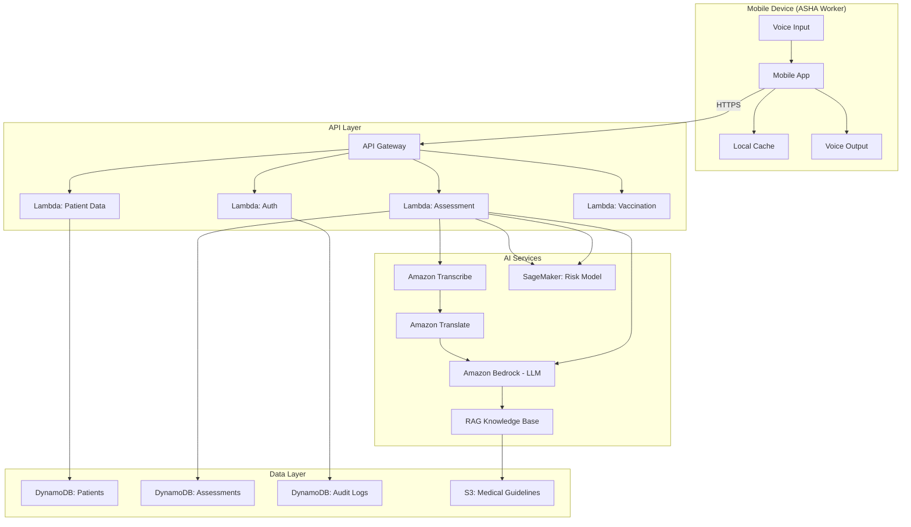

# Design Document: ASHA Worker Copilot

## Overview

The ASHA Worker Copilot is a cloud-native, voice-first health assessment system built on AWS infrastructure. The system enables ASHA workers to conduct guided health assessments through natural language conversations in regional Indian languages, leveraging AI for speech recognition, medical reasoning, and risk prediction.

The architecture follows a serverless microservices pattern with offline-first capabilities for rural connectivity scenarios. The system integrates multiple AWS AI services (Bedrock for LLM reasoning, Transcribe for speech-to-text, Translate for multilingual support) with custom ML models for risk prediction deployed on SageMaker.

## Architecture

### High-Level Architecture



### Component Interaction Flow

1. **Voice Input Flow**: Mobile App → API Gateway → Transcribe → Translate → Bedrock LLM
2. **Risk Assessment Flow**: Bedrock LLM → SageMaker Risk Model → Assessment Lambda → DynamoDB
3. **Offline Flow**: Mobile App → Local Cache → (sync when online) → API Gateway
4. **Guideline Retrieval**: Bedrock LLM → RAG Knowledge Base → S3 Medical Guidelines

### Offline-First Strategy

The mobile application maintains a local SQLite database with:
- Cached patient records (last 30 days of activity)
- Offline-capable risk model (quantized TensorFlow Lite model)
- Compressed medical guideline excerpts (most common conditions)
- Pending sync queue for assessments conducted offline

When connectivity is restored, the sync service:
1. Uploads pending assessments to DynamoDB
2. Downloads updated patient records
3. Checks for model updates
4. Refreshes guideline cache

## Components and Interfaces

### 1. Voice Interaction Service

**Responsibility**: Handle speech-to-text transcription and text-to-speech synthesis for regional languages.

**Interface**:
```typescript
interface VoiceInteractionService {
  // Transcribe audio to text
  transcribeAudio(
    audioBuffer: Buffer,
    language: RegionalLanguage,
    sessionId: string
  ): Promise<TranscriptionResult>
  
  // Synthesize text to speech
  synthesizeSpeech(
    text: string,
    language: RegionalLanguage,
    voiceGender: 'male' | 'female'
  ): Promise<AudioBuffer>
  
  // Detect language from audio
  detectLanguage(audioBuffer: Buffer): Promise<RegionalLanguage>
}

type RegionalLanguage = 'hi' | 'kn' | 'ta' | 'te' | 'bn' | 'mr'

interface TranscriptionResult {
  text: string
  confidence: number
  language: RegionalLanguage
  alternatives?: string[]
}
```

**Implementation Details**:
- Uses Amazon Transcribe with custom vocabulary for medical terms
- Implements noise reduction preprocessing using WebRTC audio processing
- Falls back to alternative transcriptions when confidence < 0.7
- Caches common phrases for offline mode

### 2. Conversation Orchestrator

**Responsibility**: Manage the guided question flow and maintain conversation context.

**Interface**:
```typescript
interface ConversationOrchestrator {
  // Start a new assessment session
  startSession(
    ashaWorkerId: string,
    patientId: string,
    language: RegionalLanguage
  ): Promise<SessionContext>
  
  // Process user input and generate next question
  processInput(
    sessionId: string,
    userInput: string
  ): Promise<ConversationResponse>
  
  // Complete session and generate assessment
  completeSession(sessionId: string): Promise<RiskAssessment>
  
  // Handle emergency detection
  checkEmergency(symptoms: string[]): EmergencyStatus
}

interface SessionContext {
  sessionId: string
  patientId: string
  ashaWorkerId: string
  language: RegionalLanguage
  conversationHistory: Message[]
  collectedSymptoms: Symptom[]
  questionCount: number
}

interface ConversationResponse {
  nextQuestion: string
  isComplete: boolean
  emergencyDetected: boolean
  confidenceScore: number
}

interface EmergencyStatus {
  isEmergency: boolean
  emergencyType?: string
  immediateActions?: string[]
  nearestFacility?: FacilityInfo
}
```

**Implementation Details**:
- Uses Amazon Bedrock (Claude or Llama model) for conversation generation
- Implements a state machine for question flow logic
- Maintains conversation context in DynamoDB with TTL (24 hours)
- Emergency keywords trigger immediate protocol activation
- Limits to 10 questions per session as per requirements

### 3. Medical Knowledge Service (RAG)

**Responsibility**: Retrieve relevant medical guidelines and protocols from ICMR and WHO India documents.

**Interface**:
```typescript
interface MedicalKnowledgeService {
  // Retrieve relevant guidelines for symptoms
  retrieveGuidelines(
    symptoms: string[],
    patientContext: PatientContext
  ): Promise<GuidelineResult[]>
  
  // Get specific protocol by condition
  getProtocol(
    conditionName: string,
    language: RegionalLanguage
  ): Promise<MedicalProtocol>
  
  // Search guidelines by query
  searchGuidelines(
    query: string,
    language: RegionalLanguage
  ): Promise<GuidelineResult[]>
}

interface GuidelineResult {
  content: string
  source: string // "ICMR" | "WHO India"
  relevanceScore: number
  guidelineId: string
  lastUpdated: Date
}

interface MedicalProtocol {
  protocolName: string
  steps: string[]
  contraindications: string[]
  referralCriteria: string[]
  source: string
}

interface PatientContext {
  age: number
  gender: 'male' | 'female' | 'other'
  isPregnant?: boolean
  gestationalAge?: number
  chronicConditions?: string[]
}
```

**Implementation Details**:
- Uses Amazon Bedrock Knowledge Base with vector embeddings
- Medical guidelines stored in S3 as structured JSON documents
- Embeddings generated using Amazon Titan Embeddings model
- Implements semantic search with relevance threshold of 0.75
- Caches frequently accessed guidelines in ElastiCache

### 4. Risk Assessment Engine

**Responsibility**: Calculate risk scores for general health and maternal health conditions.

**Interface**:
```typescript
interface RiskAssessmentEngine {
  // Assess general health risk
  assessGeneralRisk(
    symptoms: Symptom[],
    patientHistory: PatientHistory,
    guidelines: GuidelineResult[]
  ): Promise<RiskAssessment>
  
  // Calculate maternal risk score
  assessMaternalRisk(
    maternalData: MaternalHealthData,
    patientHistory: PatientHistory
  ): Promise<MaternalRiskScore>
  
  // Log assessment for monitoring
  logAssessment(
    assessment: RiskAssessment,
    metadata: AssessmentMetadata
  ): Promise<void>
}

interface RiskAssessment {
  riskLevel: 'low' | 'medium' | 'high' | 'critical'
  confidenceScore: number
  reasoning: string[]
  recommendations: string[]
  referralRequired: boolean
  guidelineReferences: string[]
}

interface MaternalRiskScore {
  overallScore: number // 0-100
  riskLevel: 'low' | 'medium' | 'high' | 'critical'
  riskFactors: RiskFactor[]
  recommendations: string[]
  nextVisitDate: Date
}

interface RiskFactor {
  factor: string
  severity: 'low' | 'medium' | 'high'
  description: string
}

interface Symptom {
  name: string
  severity: number // 1-10
  duration: string
  onset: Date
}
```

**Implementation Details**:
- General risk model deployed on SageMaker endpoint (XGBoost model)
- Maternal risk uses rule-based scoring + ML model ensemble
- Model inputs: symptoms, vital signs, patient demographics, history
- Model outputs: risk probability distribution across 4 levels
- Implements SHAP values for explainability (reasoning field)
- Logs all predictions to S3 for model monitoring

### 5. Patient Data Service

**Responsibility**: Manage patient records, history, and vaccination tracking.

**Interface**:
```typescript
interface PatientDataService {
  // Retrieve patient by ID
  getPatient(patientId: string): Promise<Patient>
  
  // Create new patient record
  createPatient(patientData: CreatePatientRequest): Promise<Patient>
  
  // Update patient information
  updatePatient(patientId: string, updates: Partial<Patient>): Promise<Patient>
  
  // Get patient history
  getPatientHistory(
    patientId: string,
    startDate?: Date,
    endDate?: Date
  ): Promise<PatientHistory>
  
  // Add assessment to history
  addAssessment(
    patientId: string,
    assessment: RiskAssessment
  ): Promise<void>
}

interface Patient {
  patientId: string
  name: string
  age: number
  gender: 'male' | 'female' | 'other'
  dateOfBirth: Date
  village: string
  ashaWorkerId: string
  contactNumber?: string
  chronicConditions: string[]
  allergies: string[]
  createdAt: Date
  updatedAt: Date
}

interface PatientHistory {
  patientId: string
  assessments: HistoricalAssessment[]
  vaccinations: VaccinationRecord[]
  maternalRecords?: MaternalRecord[]
}

interface HistoricalAssessment {
  assessmentId: string
  date: Date
  symptoms: Symptom[]
  riskLevel: string
  outcome?: string
  ashaWorkerId: string
}
```

**Implementation Details**:
- Uses DynamoDB with partition key: patientId, sort key: timestamp
- Implements GSI on ashaWorkerId for worker-specific queries
- Patient data encrypted using AWS KMS
- Implements row-level access control based on ASHA worker assignments
- History limited to last 2 years for performance

### 6. Vaccination Service

**Responsibility**: Track vaccination schedules and generate reminders.

**Interface**:
```typescript
interface VaccinationService {
  // Generate vaccination schedule for patient
  generateSchedule(
    patientId: string,
    dateOfBirth: Date,
    patientType: 'child' | 'pregnant'
  ): Promise<VaccinationSchedule>
  
  // Record administered vaccination
  recordVaccination(
    patientId: string,
    vaccineName: string,
    administeredDate: Date
  ): Promise<void>
  
  // Get due vaccinations for patient
  getDueVaccinations(patientId: string): Promise<DueVaccination[]>
  
  // Get reminders for ASHA worker
  getReminders(
    ashaWorkerId: string,
    daysAhead: number
  ): Promise<VaccinationReminder[]>
  
  // Get overdue vaccinations
  getOverdueVaccinations(ashaWorkerId: string): Promise<DueVaccination[]>
}

interface VaccinationSchedule {
  patientId: string
  scheduleType: 'child' | 'pregnant'
  vaccinations: ScheduledVaccination[]
}

interface ScheduledVaccination {
  vaccineName: string
  dueDate: Date
  ageAtAdministration: string
  isAdministered: boolean
  administeredDate?: Date
}

interface DueVaccination {
  patientId: string
  patientName: string
  vaccineName: string
  dueDate: Date
  daysOverdue?: number
}

interface VaccinationReminder {
  patientId: string
  patientName: string
  vaccineName: string
  dueDate: Date
  daysUntilDue: number
}
```

**Implementation Details**:
- Vaccination schedules based on Government of India Universal Immunization Programme
- Uses DynamoDB with GSI on dueDate for efficient reminder queries
- EventBridge scheduled rule triggers daily reminder generation
- Supports both child immunization schedule and maternal vaccination schedule
- Reminder notifications sent via SNS to mobile app

### 7. Authentication and Authorization Service

**Responsibility**: Authenticate ASHA workers and enforce access controls.

**Interface**:
```typescript
interface AuthService {
  // Authenticate ASHA worker
  authenticate(
    username: string,
    password: string
  ): Promise<AuthToken>
  
  // Validate token
  validateToken(token: string): Promise<TokenPayload>
  
  // Check patient access permission
  canAccessPatient(
    ashaWorkerId: string,
    patientId: string
  ): Promise<boolean>
  
  // Get assigned patients for worker
  getAssignedPatients(ashaWorkerId: string): Promise<string[]>
}

interface AuthToken {
  accessToken: string
  refreshToken: string
  expiresIn: number
  ashaWorkerId: string
}

interface TokenPayload {
  ashaWorkerId: string
  name: string
  assignedArea: string
  permissions: string[]
}
```

**Implementation Details**:
- Uses Amazon Cognito for user authentication
- JWT tokens with 1-hour expiration
- Patient assignments stored in DynamoDB
- Implements geographic-based access control (ASHA worker can only access patients in assigned villages)
- All API calls require valid JWT token in Authorization header

### 8. Sync Service

**Responsibility**: Synchronize offline data when connectivity is restored.

**Interface**:
```typescript
interface SyncService {
  // Upload pending assessments
  syncAssessments(
    assessments: OfflineAssessment[]
  ): Promise<SyncResult>
  
  // Download updated patient data
  downloadPatientUpdates(
    ashaWorkerId: string,
    lastSyncTimestamp: Date
  ): Promise<PatientUpdate[]>
  
  // Check for model updates
  checkModelUpdates(
    currentModelVersion: string
  ): Promise<ModelUpdateInfo>
  
  // Download guideline updates
  downloadGuidelineUpdates(
    lastSyncTimestamp: Date
  ): Promise<GuidelineUpdate[]>
}

interface SyncResult {
  successCount: number
  failureCount: number
  conflicts: ConflictInfo[]
}

interface OfflineAssessment {
  localId: string
  patientId: string
  timestamp: Date
  assessment: RiskAssessment
  syncStatus: 'pending' | 'synced' | 'failed'
}
```

**Implementation Details**:
- Implements conflict resolution: server data wins for patient records
- Batch uploads with exponential backoff on failures
- Compresses data before upload to minimize bandwidth
- Uses DynamoDB conditional writes to prevent duplicate assessments
- Tracks sync status in local SQLite database

## Data Models

### DynamoDB Tables

#### Patients Table
```typescript
{
  PK: "PATIENT#<patientId>",
  SK: "METADATA",
  patientId: string,
  name: string,
  age: number,
  gender: string,
  dateOfBirth: string, // ISO 8601
  village: string,
  ashaWorkerId: string,
  contactNumber?: string,
  chronicConditions: string[],
  allergies: string[],
  createdAt: string,
  updatedAt: string,
  
  // GSI
  GSI1PK: "ASHA#<ashaWorkerId>",
  GSI1SK: "PATIENT#<patientId>"
}
```

#### Assessments Table
```typescript
{
  PK: "PATIENT#<patientId>",
  SK: "ASSESSMENT#<timestamp>",
  assessmentId: string,
  patientId: string,
  ashaWorkerId: string,
  timestamp: string,
  symptoms: Symptom[],
  riskLevel: string,
  confidenceScore: number,
  reasoning: string[],
  recommendations: string[],
  referralRequired: boolean,
  guidelineReferences: string[],
  outcome?: string,
  
  // TTL for old assessments (2 years)
  ttl: number
}
```

#### Vaccinations Table
```typescript
{
  PK: "PATIENT#<patientId>",
  SK: "VACCINE#<vaccineName>#<dueDate>",
  patientId: string,
  vaccineName: string,
  dueDate: string,
  isAdministered: boolean,
  administeredDate?: string,
  administeredBy?: string,
  
  // GSI for reminders
  GSI1PK: "ASHA#<ashaWorkerId>",
  GSI1SK: "DUE#<dueDate>"
}
```

#### Sessions Table
```typescript
{
  PK: "SESSION#<sessionId>",
  SK: "METADATA",
  sessionId: string,
  patientId: string,
  ashaWorkerId: string,
  language: string,
  conversationHistory: Message[],
  collectedSymptoms: Symptom[],
  questionCount: number,
  startTime: string,
  lastActivity: string,
  
  // TTL: 24 hours
  ttl: number
}
```

#### Audit Logs Table
```typescript
{
  PK: "AUDIT#<date>",
  SK: "LOG#<timestamp>#<ashaWorkerId>",
  timestamp: string,
  ashaWorkerId: string,
  action: string, // "VIEW_PATIENT" | "CREATE_ASSESSMENT" | "UPDATE_PATIENT"
  patientId: string,
  ipAddress: string,
  userAgent: string,
  
  // TTL: 7 years (compliance requirement)
  ttl: number
}
```

### S3 Data Structure

```
s3://asha-copilot-guidelines/
  ├── icmr/
  │   ├── maternal-health/
  │   │   ├── guideline-001.json
  │   │   └── guideline-002.json
  │   ├── child-health/
  │   └── infectious-diseases/
  ├── who-india/
  │   ├── immunization/
  │   └── emergency-protocols/
  └── embeddings/
      └── guidelines-embeddings.index

s3://asha-copilot-models/
  ├── risk-assessment/
  │   ├── v1.0/
  │   │   ├── model.tar.gz
  │   │   └── metadata.json
  │   └── v1.1/
  └── offline-models/
      └── risk-model-lite.tflite
```

### Local SQLite Schema (Mobile App)

```sql
CREATE TABLE patients (
  patient_id TEXT PRIMARY KEY,
  name TEXT NOT NULL,
  age INTEGER,
  gender TEXT,
  date_of_birth TEXT,
  village TEXT,
  last_synced TEXT
);

CREATE TABLE assessments (
  assessment_id TEXT PRIMARY KEY,
  patient_id TEXT,
  timestamp TEXT,
  risk_level TEXT,
  symptoms TEXT, -- JSON
  sync_status TEXT, -- 'pending' | 'synced' | 'failed'
  FOREIGN KEY (patient_id) REFERENCES patients(patient_id)
);

CREATE TABLE vaccinations (
  vaccination_id TEXT PRIMARY KEY,
  patient_id TEXT,
  vaccine_name TEXT,
  due_date TEXT,
  is_administered INTEGER,
  administered_date TEXT,
  FOREIGN KEY (patient_id) REFERENCES patients(patient_id)
);

CREATE TABLE cache_metadata (
  key TEXT PRIMARY KEY,
  value TEXT,
  last_updated TEXT
);
```


## Correctness Properties

*A property is a characteristic or behavior that should hold true across all valid executions of a system—essentially, a formal statement about what the system should do. Properties serve as the bridge between human-readable specifications and machine-verifiable correctness guarantees.*

### Voice Interaction Properties

**Property 1: Transcription Quality Threshold**
*For any* audio input in a supported regional language, the transcription confidence score should meet the minimum threshold required for medical assessment (≥ 0.7), or the system should request clarification.
**Validates: Requirements 1.1**

**Property 2: Language Consistency**
*For any* voice interaction (including responses and clarification requests), the output language should match the input language detected from the ASHA worker's speech.
**Validates: Requirements 1.2, 1.5**

**Property 3: Low Confidence Clarification**
*For any* transcription with confidence score below 0.7, the system should generate a clarification request rather than proceeding with potentially incorrect input.
**Validates: Requirements 1.5**

### Risk Assessment Properties

**Property 4: Contextual Follow-up Questions**
*For any* reported symptom, the system should generate follow-up questions that reference medical terms or concepts related to that symptom category.
**Validates: Requirements 2.1, 6.1**

**Property 5: Valid Risk Level Output**
*For any* completed symptom assessment, the risk level output should be exactly one of: 'low', 'medium', 'high', or 'critical'.
**Validates: Requirements 2.2**

**Property 6: Guideline-Based Assessment**
*For any* risk assessment, the guidelineReferences field should contain at least one reference from ICMR or WHO India sources.
**Validates: Requirements 2.3, 3.4**

**Property 7: Critical Risk Referral**
*For any* risk assessment with riskLevel = 'critical', the referralRequired field should be true.
**Validates: Requirements 2.4**

**Property 8: Assessment Completeness**
*For any* risk assessment, the reasoning field should be non-empty and the recommendations field should contain at least one actionable recommendation with guideline citations.
**Validates: Requirements 2.5, 7.3**

**Property 9: Question Count Limit**
*For any* assessment session, the questionCount should never exceed 10 before the session is marked as complete.
**Validates: Requirements 6.5**

**Property 10: Question Progression**
*For any* assessment session, questions should not repeat (each question should be unique within the session) and should cover different clinical aspects.
**Validates: Requirements 6.2**

**Property 11: Severity-Based Prioritization**
*For any* assessment session where a serious symptom is detected (emergency keywords or high severity score), the next question should focus on severity or urgency assessment.
**Validates: Requirements 6.3**

**Property 12: Session Completion**
*For any* assessment session, when sufficient information is gathered or question limit is reached, isComplete should be set to true and a risk assessment should be generated.
**Validates: Requirements 6.4**

### Maternal Health Properties

**Property 13: Maternal Risk Score Generation**
*For any* maternal health data input (including age, gestational age, blood pressure, hemoglobin, and symptoms), the system should generate a maternal risk score between 0 and 100 with a corresponding risk level.
**Validates: Requirements 3.1**

**Property 14: Risk Factor Sensitivity**
*For any* maternal health assessment, changing any of the key risk factors (age, gestational age, blood pressure, hemoglobin, previous complications) should affect the calculated risk score.
**Validates: Requirements 3.2**

**Property 15: High Risk Recommendations**
*For any* maternal risk assessment with riskLevel = 'high' or 'critical', the recommendations field should be non-empty and contain specific interventions or referrals.
**Validates: Requirements 3.3**

**Property 16: Maternal Risk Recalculation**
*For any* patient with existing maternal risk data, providing updated maternal health information should produce a new risk score that reflects the changes.
**Validates: Requirements 3.5**

### Vaccination Properties

**Property 17: Schedule Generation**
*For any* valid date of birth and patient type ('child' or 'pregnant'), the system should generate a vaccination schedule containing at least one scheduled vaccination.
**Validates: Requirements 4.1**

**Property 18: Vaccination Recording**
*For any* vaccination record operation, recording a vaccination should set isAdministered to true and populate the administeredDate field, and subsequent queries should reflect this updated status.
**Validates: Requirements 4.2**

**Property 19: Reminder Generation**
*For any* vaccination with dueDate within 7 days from the current date and isAdministered = false, the system should include it in the reminders list for the assigned ASHA worker.
**Validates: Requirements 4.3**

**Property 20: Overdue Detection**
*For any* vaccination with dueDate in the past and isAdministered = false, the system should flag it as overdue with daysOverdue calculated correctly.
**Validates: Requirements 4.4**

**Property 21: Vaccination Status Completeness**
*For any* patient vaccination status query, the response should include all vaccinations from the patient's schedule, with both administered and pending vaccinations clearly indicated.
**Validates: Requirements 4.6**

### Patient History Properties

**Property 22: History Retrieval**
*For any* valid patient identifier, the system should return a patient history object (which may be empty for new patients but should not error).
**Validates: Requirements 5.1**

**Property 23: Assessment Storage Round-Trip**
*For any* completed assessment, storing it to patient history and then retrieving the history should include that assessment in the returned data.
**Validates: Requirements 5.2**

**Property 24: History Data Completeness**
*For any* stored patient history entry, it should contain all required fields: symptoms, risk assessment, timestamp, and ASHA worker ID.
**Validates: Requirements 5.3**

**Property 25: Chronological Ordering**
*For any* patient history with multiple entries, the entries should be sorted by timestamp in descending order (most recent first).
**Validates: Requirements 5.4**

**Property 26: New Patient Creation**
*For any* non-existent patient ID, creating a patient record should succeed, and subsequent retrieval should return the created patient data with matching fields.
**Validates: Requirements 5.5**

### Multilingual Properties

**Property 27: Guideline Translation Consistency**
*For any* guideline retrieval request in a specific regional language, the returned guideline content should be in that language.
**Validates: Requirements 7.2**

**Property 28: Missing Guideline Handling**
*For any* condition where no relevant guidelines are found (relevance score < 0.75), the system should indicate the limitation in the response and provide general guidance.
**Validates: Requirements 7.5**

### Offline Sync Properties

**Property 29: Offline Assessment Creation**
*For any* assessment conducted in offline mode, the assessment should be stored in the local database with syncStatus = 'pending'.
**Validates: Requirements 8.1, 8.2**

**Property 30: Offline-to-Cloud Round-Trip**
*For any* assessment created offline, after sync operation completes successfully, the assessment should exist in the cloud database and the local syncStatus should be updated to 'synced'.
**Validates: Requirements 8.3**

**Property 31: Connectivity Mode Indication**
*For any* system state, the connectivity mode (online/offline) should be accurately reflected and accessible to the application layer.
**Validates: Requirements 8.4**

**Property 32: Offline Resource Usage**
*For any* assessment conducted in offline mode, the system should use cached guidelines and models (not attempt network calls), and the assessment should still produce a valid risk level.
**Validates: Requirements 8.5**

### Security Properties

**Property 33: Data Encryption**
*For any* patient data storage operation, the data should be encrypted at rest, and for any API call, the connection should use HTTPS/TLS encryption.
**Validates: Requirements 9.1**

**Property 34: Authentication Enforcement**
*For any* API request to access patient data without a valid authentication token, the system should return an authentication error (401 Unauthorized).
**Validates: Requirements 9.2**

**Property 35: Geographic Access Control**
*For any* ASHA worker attempting to access a patient not assigned to their geographic area, the system should deny access and return an authorization error (403 Forbidden).
**Validates: Requirements 9.3**

**Property 36: Audit Logging**
*For any* patient data access or modification operation, an audit log entry should be created with timestamp, ASHA worker ID, action type, and patient ID.
**Validates: Requirements 9.4**

### Model Monitoring Properties

**Property 37: Assessment Logging**
*For any* risk assessment generated, a log entry should be created containing the input symptoms, patient context, and output prediction with confidence score.
**Validates: Requirements 10.1**

**Property 38: Outcome Recording**
*For any* risk assessment, the system should support recording a clinical outcome, and the outcome should be associated with the original assessment for model evaluation.
**Validates: Requirements 10.2**

**Property 39: Accuracy Threshold Alerting**
*For any* model accuracy calculation that results in accuracy < 85%, an alert should be generated for administrators.
**Validates: Requirements 10.4**

**Property 40: Model Version Support**
*For any* risk assessment request, the system should support routing to different model versions based on A/B testing configuration, and the model version used should be logged.
**Validates: Requirements 10.5**

### Emergency Protocol Properties

**Property 41: Emergency Detection**
*For any* symptom input containing emergency keywords (severe bleeding, difficulty breathing, loss of consciousness, severe chest pain), the system should immediately set emergencyDetected = true.
**Validates: Requirements 11.1**

**Property 42: Emergency Response Completeness**
*For any* detected emergency, the response should include both step-by-step emergency instructions and nearest facility information (contact and location).
**Validates: Requirements 11.2, 11.3**

**Property 43: Emergency Prioritization**
*For any* assessment session where an emergency is detected, the session should complete immediately (isComplete = true) without waiting for the full question flow.
**Validates: Requirements 11.4**

**Property 44: Emergency Event Logging**
*For any* emergency protocol activation, an event log should be created with timestamp, patient ID, emergency type, and ASHA worker ID.
**Validates: Requirements 11.5**

### Performance Properties

**Property 45: Loading Indicator Display**
*For any* operation that exceeds its expected response time threshold, the system should set a loading state indicator to true before the operation completes.
**Validates: Requirements 12.5**

## Error Handling

### Error Categories

1. **Input Validation Errors**
   - Invalid patient ID format
   - Missing required fields in requests
   - Invalid date formats
   - Out-of-range values (e.g., age < 0, gestational age > 42 weeks)

2. **Authentication/Authorization Errors**
   - Invalid or expired JWT token
   - Insufficient permissions for requested operation
   - Attempt to access patient outside assigned area

3. **Service Errors**
   - Transcribe service unavailable
   - Bedrock LLM timeout
   - SageMaker endpoint error
   - DynamoDB throttling

4. **Data Errors**
   - Patient not found
   - Duplicate vaccination record
   - Sync conflict (offline data conflicts with server data)

5. **Emergency Errors**
   - Unable to retrieve facility information during emergency
   - Emergency protocol activation failure

### Error Handling Strategies

**Input Validation**:
- Validate all inputs at API Gateway using JSON Schema validation
- Return 400 Bad Request with detailed error messages
- Sanitize inputs to prevent injection attacks

**Authentication/Authorization**:
- Return 401 Unauthorized for invalid/expired tokens
- Return 403 Forbidden for insufficient permissions
- Log all authentication failures to audit log

**Service Failures**:
- Implement exponential backoff with jitter for retries (max 3 attempts)
- Circuit breaker pattern for external service calls
- Fallback to cached data when services unavailable
- Return 503 Service Unavailable with retry-after header

**Data Errors**:
- Return 404 Not Found for missing resources
- Return 409 Conflict for duplicate records
- Implement last-write-wins for sync conflicts
- Log all data errors for investigation

**Emergency Errors**:
- Never fail emergency protocol activation
- Use fallback facility information (district hospital) if lookup fails
- Log emergency errors with high priority for immediate investigation
- Display generic emergency instructions even if specific protocol fails

### Error Response Format

```typescript
interface ErrorResponse {
  error: {
    code: string // "INVALID_INPUT" | "UNAUTHORIZED" | "SERVICE_ERROR" | etc.
    message: string // Human-readable error message
    details?: any // Additional error context
    requestId: string // For tracking and debugging
    timestamp: string
  }
}
```

### Graceful Degradation

**Offline Mode**:
- When cloud services unavailable, use local models and cached data
- Queue operations for later sync
- Inform user of degraded functionality

**Partial Service Failure**:
- If guideline retrieval fails, proceed with risk assessment using model only
- If translation fails, return content in English with language indicator
- If voice synthesis fails, display text output

**Emergency Scenarios**:
- Emergency detection never depends on external services
- Emergency protocols stored locally on device
- Facility information cached for offline access

## Testing Strategy

### Dual Testing Approach

The ASHA Worker Copilot requires both unit testing and property-based testing for comprehensive coverage:

**Unit Tests**: Focus on specific examples, edge cases, and integration points
- Specific symptom combinations and expected risk levels
- Edge cases: empty inputs, boundary values, malformed data
- Integration between services (mocked external dependencies)
- Error handling scenarios
- Emergency keyword detection with specific examples

**Property-Based Tests**: Verify universal properties across all inputs
- Generate random patient data, symptoms, and health records
- Verify properties hold for all generated inputs (minimum 100 iterations per test)
- Test invariants that should always hold regardless of input
- Validate round-trip properties (store/retrieve, serialize/deserialize)
- Ensure consistency across language translations

### Property-Based Testing Configuration

**Framework**: Use `fast-check` for TypeScript/JavaScript, `hypothesis` for Python components

**Test Configuration**:
- Minimum 100 iterations per property test
- Each test tagged with: `Feature: asha-worker-copilot, Property {number}: {property_text}`
- Seed-based reproducibility for failed tests
- Shrinking enabled to find minimal failing examples

**Example Property Test Structure**:
```typescript
// Feature: asha-worker-copilot, Property 5: Valid Risk Level Output
test('risk assessment always returns valid risk level', async () => {
  await fc.assert(
    fc.asyncProperty(
      fc.array(symptomGenerator()), // Generate random symptoms
      fc.record(patientContextGenerator()), // Generate random patient context
      async (symptoms, context) => {
        const assessment = await riskEngine.assessGeneralRisk(
          symptoms,
          context,
          []
        );
        
        const validLevels = ['low', 'medium', 'high', 'critical'];
        expect(validLevels).toContain(assessment.riskLevel);
      }
    ),
    { numRuns: 100 }
  );
});
```

### Test Coverage Requirements

**Unit Test Coverage**:
- Minimum 80% code coverage for business logic
- 100% coverage for error handling paths
- All emergency keywords tested explicitly
- All supported languages tested with example inputs

**Property Test Coverage**:
- Each correctness property implemented as a property-based test
- All CRUD operations tested with round-trip properties
- All risk assessment paths tested with random inputs
- All language combinations tested for consistency

### Integration Testing

**API Integration Tests**:
- Test complete flows: voice input → transcription → assessment → storage
- Test authentication and authorization enforcement
- Test offline sync scenarios
- Mock external AWS services (Transcribe, Bedrock, SageMaker)

**End-to-End Tests**:
- Test critical user journeys with real AWS services (staging environment)
- Maternal health assessment flow
- Vaccination reminder flow
- Emergency protocol activation flow
- Offline-to-online sync flow

### Performance Testing

**Load Testing**:
- Simulate 1000 concurrent ASHA workers
- Test API Gateway and Lambda scaling
- Verify DynamoDB auto-scaling
- Measure p95 and p99 latencies

**Stress Testing**:
- Test offline sync with 1000+ pending assessments
- Test large patient history retrieval (2 years of data)
- Test SageMaker endpoint under load

**Benchmark Tests**:
- Voice transcription latency (target: < 3 seconds)
- Risk assessment latency (target: < 5 seconds)
- Patient history retrieval (target: < 2 seconds)
- Offline assessment latency (target: < 10 seconds)

### Security Testing

**Authentication Tests**:
- Test token expiration and refresh
- Test invalid token rejection
- Test brute force protection

**Authorization Tests**:
- Test geographic access control
- Test cross-ASHA worker data access prevention
- Test audit log creation

**Data Security Tests**:
- Verify encryption at rest (DynamoDB, S3)
- Verify encryption in transit (TLS)
- Test data sanitization and injection prevention

### Monitoring and Observability

**Metrics to Track**:
- API latency (p50, p95, p99)
- Error rates by error type
- Model prediction accuracy
- Offline sync success rate
- Emergency protocol activation rate

**Alarms**:
- API error rate > 5%
- Model accuracy < 85%
- Sync failure rate > 10%
- Emergency protocol failures (any occurrence)

**Logging**:
- Structured JSON logs with correlation IDs
- CloudWatch Logs for all Lambda functions
- Audit logs in dedicated DynamoDB table
- Model prediction logs in S3 for analysis

### Test Data Management

**Synthetic Data Generation**:
- Generate realistic patient data for testing
- Include diverse age ranges, conditions, and symptoms
- Cover all supported regional languages
- Include edge cases (very young, very old, multiple conditions)

**Test Data Privacy**:
- Never use real patient data in tests
- Anonymize any production data used for model training
- Comply with DISHA guidelines for test data handling

**Data Refresh**:
- Refresh test data monthly to include new scenarios
- Update medical guidelines in test environment when updated in production
- Maintain separate test and production databases
